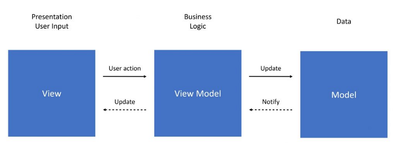
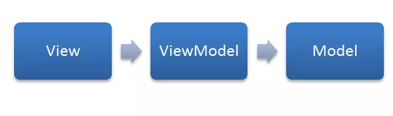
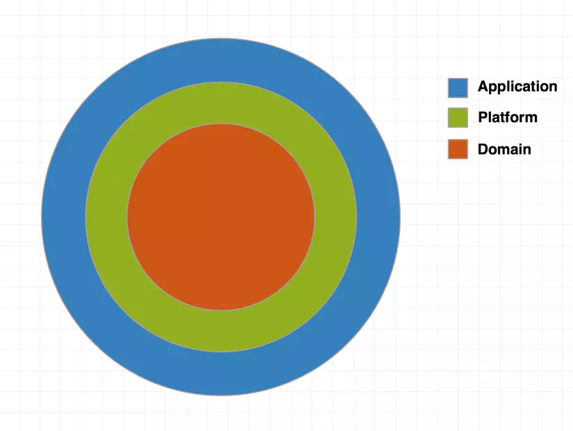

# Flutter code base

Simple Flutter code base for people who want to develop application quickly.


## Installation

For stared, run the following commands to install libraries and auto generate files.

```bash
make gen
```
    
## Libraries

In this, we will use some core dependencies:
- [GetX](https://pub.dev/packages/get): manage screen's state
- [MobX](https://pub.dev/packages/mobx): binding data between View and ViewModel
- [Dio](https://pub.dev/packages/dio) and [Retrofit](https://pub.dev/packages/retrofit) for networking
## Architecture

### MVVM Architecture

MVVM is a architecture consisting of three main components: View - View Model - Model, created with the purpose of simplifying user interface event programming.



### MVVM components

- **View**: the user interface component of the application responsible for displaying data and receiving user interactions. However, unlike MVC, in MVVM, the View is more active as it can actively respond to users through features like Binding or Command.
- **Model**: Similar to the MVC pattern, Model consists of objects used to access and manipulate data.
- **View Model**: It serves as an intermediary between View and Model. The ViewModel plays the role of facilitating data transfer between View and Model and contains the necessary code to implement Binding and Command.

Unlike MVC, in MVVM, the View and Model are completely independent of each other. In MVVM, the lower layers do not have any knowledge of the layers above them. This means that the Model does not know anything about View Model, and the View Model will have no knowledge of the View.



### Clean Architecture



In terms of structure, Clean architecture consists of three main components:

- **Domain**: contains the core components of the application, such as Entities, Use Cases, etc. The Domain layer is not dependent on any UI components or any specific framework, and it does not implement any application components at this level.
- **Platform**: is responsible for implementing the specific parts of the Domain layer. However, the Platform layer hides all implementation details.
- **Application**: is responsible for providing information from the application to the user and receiving input from the user for the application. It can be implemented using various patterns such as MVC, MVP, MVVM, etc.

#### Domain:

In the Domain layer, we store Entities, base class for architecture, etc, which are the fundamental components of the application. All Entities within the Domain are completely independent and do not depend on any other components of the application.

```dart
@freezed
class GithubOwner with _$GithubOwner {
  const factory GithubOwner({
    required int id,
    @JsonKey(name: 'avatar_url') @Default("") String avatarURL,
    @JsonKey(name: 'url') @Default("") String url,
  }) = _GithubOwner;

  factory GithubOwner.fromJson(Map<String, dynamic> json) => _$GithubOwnerFromJson(json);
}
```

```dart
@freezed
class GithubRepo with _$GithubRepo {
  const factory GithubRepo({
    @JsonKey(name: 'id') required int id,
    @JsonKey(name: 'name') @Default("") String name,
    @JsonKey(name: 'full_name') @Default("") String fullName,
    @JsonKey(name: 'html_url') @Default("") String urlString,
    @JsonKey(name: 'stargazers_count') @Default(0) int starCount,
    @JsonKey(name: 'forks') @Default(0) int folkCount,
    @JsonKey(name: 'owner') required GithubOwner owner,
  }) = _GithubRepo;

  factory GithubRepo.fromJson(Map<String, dynamic> json) => _$GithubRepoFromJson(json);
}
```

#### Platform:

Platform layer includes services for application, such as API service, local data service, etc. They will be implemented in platform layer and interact directly with domain layer.

```dart
@RestApi()
abstract class APIService {
  factory APIService() => _APIService(APIDio.getInstance());

  static final APIService shared = APIService();

  @GET('/search/repositories')
  Future<GithubRepoOutput> fetchRepositories(@Queries() Map<String, dynamic> queries);
}
```

#### Application

##### **View**

The View will extend a abstract class called `ViewType`. When any View extends this abstract class, it has a property called viewModel responsible for holding an instance of the ViewModel within the View.

```dart
abstract class ViewType<ViewModel extends GetxController> extends StatelessWidget {

  const ViewType({super.key});

  ViewModel get viewModel => GetInstance().find<ViewModel>();
}
```

In the following code, beside View we have a class which called Binding. Bindings are dependency injection classes. They are completely outside your widget tree, making your code cleaner, more organized, and allowing you to access it anywhere without context. You can initialize dozens of controllers in your Bindings, when you need to know what is being injected into your view, just open the Bindings and that's it, you can clearly see what has been prepared to be initialized in your View. Bindings is the first step towards having a scalable application, you can visualize what will be injected into your page, and decouple the dependency injection from your visualization layer.

```dart
class HomeBinding implements Bindings {
  @override
  void dependencies() {
    Get.put<HomeUseCaseType>(HomeUseCase());
    Get.put<HomeNavigatorType>(HomeNavigator());
    Get.put<HomeViewModel>(HomeViewModel());
  }
}

class HomeView extends ViewType<HomeViewModel> {

  const HomeView({super.key});

  @override
  Widget build(BuildContext context) {
    return CupertinoTabView(
      navigatorKey: Get.nestedKey(RouteNestedKey.home),
      builder: _buildViews,
      onGenerateRoute: (settings) => AppPages.getPageRoute(RouteName.home, settings),
    );
  }

  Widget _buildViews(BuildContext context) {
    return Scaffold(
      appBar: _buildAppBar(context),
      body: SafeArea(
        child: _buildContentView(context),
      ),
    );
  }

  PreferredSizeWidget _buildAppBar(BuildContext context) {
    return ...;
  }

  Widget _buildContentView(BuildContext context) {
    return ...;
}
```

##### **ViewModel**

```dart
abstract class ViewModelType<UseCaseType, NavigatorType, ArgumentType> extends GetxController {

  UseCaseType get useCase => GetInstance().find<UseCaseType>()!;

  NavigatorType get navigator => GetInstance().find<NavigatorType>()!;

  late ArgumentType arguments;

  @override
  void onInit() {
    super.onInit();
    parseArguments();
  }

  void parseArguments() {
    try {
      arguments = Get.arguments as ArgumentType;
      Get.log('"${runtimeType.toString()}" Argument: $arguments');
    } catch (error) {
      Get.log('"${runtimeType.toString()}" Missing argument');
    }
  }
}
```

All ViewModel will be extended from ViewModelType which has 3 main properties:
- Use Case: contains detail logic, calculate functions, etc.
- Navigator: main responsibility is navigate between 2 screens or show bottom sheet, alert, etc.
- Arguments: contains data which is passed from other screen.

ViewModel's responsibilities are prepare and transfer data. When we have something changes, ViewModel will notify to View, and View will be updated.

GetX and MobX are two dependencies help us manage application state easier by `GetxController` in GetX and `Store` in MobX. Clesses will reduce number line of code, easy read and scale in the future.

```dart
class HomeViewModel = _HomeViewModel with _$HomeViewModel;

abstract class _HomeViewModel extends ViewModelType<HomeUseCaseType, HomeNavigatorType, void> with Store {

  @observable
  List<GithubRepo> githubRepos = [];

  @override
  void onReady() {
    super.onReady();
    loadRepositories();
  }
}

extension HomeViewModelData on _HomeViewModel {

  @action
  Future<void> loadRepositories() async {
    final repos = await useCase.fetchGithubRepositories(1);
    githubRepos = repos;
  }
}

extension HomeViewModelAction on _HomeViewModel {

  @action
  Future<void> toRepoDetail(GithubRepo repo) async {
    final dto = RepoDetailDTO(repo);
    navigator.toRepoDetail(dto);
  }
}
```

##### **UseCase**

Use Case responsibility is contains detailed logical, calculate functions, or anything related to logical. Each screen, we have own UseCase. Its help us easy to maintain application and reduce risk when want to update a screen.

```dart
abstract class HomeUseCaseType {
  Future<List<GithubRepo>> fetchGithubRepositories(int page);
}

class HomeUseCase implements HomeUseCaseType {

  @override
  Future<List<GithubRepo>> fetchGithubRepositories(int page) async {
    return ...;
  }
}
```

##### **Navigator**

Navigator has main responsibility is navigate between two screens or show bottom sheet, alert, etc. Detached navigating logical from View.
In this, GetX help us inject `Navigator` object and manage `Route` easier. We can navigate to other screen neither use NestedKey or not.

```dart
abstract class HomeNavigatorType {
  toRepoDetail(RepoDetailDTO dto);
}

class HomeNavigator implements HomeNavigatorType {
  
  @override
  toRepoDetail(RepoDetailDTO dto) {
    Get.toNamed(RouteName.repoDetail, arguments: dto, id: RouteNestedKey.home);
  }
}
```

## License

The project consents [the MIT license](LICENSE).
